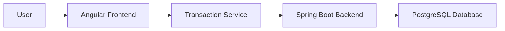

# Exptrackz

**Author:** Mohamed Aziz Mejbri  
**Project:** Web-based Expense Tracking Application  

Exptrackz is a full-stack web application designed to help users manage personal finances efficiently. It allows users to log expenses and revenues, visualize financial trends, receive notifications for budget thresholds, and generate reports in multiple formats including PDF, CSV, Markdown, JSON, and HTML.

---

## Features

- **Secure Authentication**: Login, signup, and JWT-based session management with refresh tokens.
- **Expense & Revenue Tracking**: Add, edit, delete, and view financial transactions.
- **Dashboard**: Interactive overview of income, expenses, and balance trends.
- **Category Statistics**: Visualize spending and income by categories.
- **Budget Alerts**: Notifications when expenses exceed defined thresholds.
- **Reports**: Generate and export financial data in multiple formats (PDF, CSV, JSON, Markdown, HTML).
- **Responsive Design**: Works on desktops with dark mode support.
- **Dockerized Deployment**: Runs consistently across environments using Docker and Docker Compose.

---

## Technology Stack

- **Frontend:** Angular, TypeScript, HTML, SCSS  
- **Backend:** Spring Boot (Java), REST APIs  
- **Database:** PostgreSQL  
- **Containerization:** Docker, Docker Compose  
- **Version Control:** Git  
- **Reporting:** PDF, CSV, Markdown, JSON, HTML exports  

---

## System Architecture

Exptrackz follows a standard client-server architecture:




<br>
- Frontend handles user interactions, charts, dashboards, and report generation.
- Backend handles authentication, business logic, database operations, and report formatting.
- Database stores user credentials, transactions, budgets, and metadata.
- Docker ensures environment consistency across development and production.

---

## Installation

### Prerequisites

- Node.js (v18+)
- npm or yarn
- Java JDK 17+
- Maven
- Docker & Docker Compose
- PostgreSQL

---

### Backend Setup

1. Clone the repository:
```bash
git clone https://github.com/username/exptrackz.git
cd exptrackz/backend
```

2. Configure database connection in application.properties:

```properties
spring.datasource.url=jdbc:postgresql://localhost:5432/exptrackz
spring.datasource.username=postgres
spring.datasource.password=yourpassword
```

3. Add a .env file to which you add your lacking secret data
```.env 
DB_HOST=yourdbhost
JWT_SECRET=yourjwtsecret
```

4. Build and run backend:

```bash
mvn clean install
mvn spring-boot:run
```

Alternatively, run backend using Docker:

```bash
docker-compose up backend
```

### Frontend Setup

1. Navigate to frontend folder:

```bash
cd ../frontend
```

2. Install dependencies:

```bash
npm install
```

Run Angular development server:

```bash
ng serve --open
```

Or run using Docker:

```bash
docker-compose up frontend
```

## Usage
- Register a new account or login with existing credentials.

- Add expenses and revenues via the dashboard.

- View summaries, trends, and category statistics.

- Set budgets and receive notifications when thresholds are exceeded.

- Generate reports in desired formats via the Reports section.

- Log out when finished.

## API Endpoints
Some key backend endpoints:


| Endpoint                                      | Method | Description                               |
|-----------------------------------------------|--------|-------------------------------------------|
| /auth/login                                   | POST   | Authenticate user and return JWT tokens   |
| /auth/signup                                  | POST   | Register a new user                        |
| /users/{id}/transactions                      | GET    | Retrieve transactions for a user          |
| /users/{id}/transactions                      | POST   | Create a new transaction                   |
| /users/{id}/transactions/summary             | GET    | Retrieve transaction summary               |
| /users/{id}/transactions/categories/summary  | GET    | Retrieve category-wise summary             |
| /login/refresh                                | POST   | Refresh JWT token pair                     |
| /login/refresh-access                         | POST   | Refresh access token only                  |

## Screenshots
[for the reports visit the reports.md Screenshots Section!](https://github.com/AzizMejbri/exptrack/blob/master/report.md#screenshots)

## Testing
Manual testing: Authentication flows, transaction CRUD, report generation, budget notifications.
Only Manual testing was performed, no unit testing or integration testing was made.


## License
This project is licensed under the MIT License. More on that [here](https://github.com/AzizMejbri/exptrack/blob/master/LICENSE)

## Other: 
- This project was made for fun, and for educational purposes, it is only
  natural that it would be buggy and unstable 
- The website is actually deployed and usable online, [you can visit it now!](exptrackz-omega.vercel.app)
- The backend was deployed on render, so it might take time for loading
  initially if it was left unused for some time, and the limitations imposed by
  render was 512MB of memory and 0.15 CPU, so there might be performance issues
- If you run locally, the endpoints documentation with [swagger-ui](https://github.com/AzizMejbri/exptrack/blob/master/assets/swagger-ui/index.html) will be
  generated in `https://localhost:{your backend port}/swagger-ui/index.html#/`
